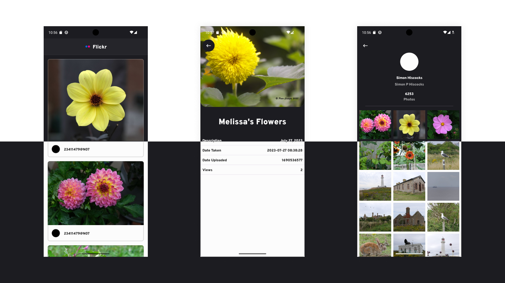

Flickr App
==================

App that use the FlickrApi to display a list of images.
Tapping a image opens the second screen with detail about the selected image.

Tapping on a user icon associated with a photo opens a screen in which information about that user is displayed & a long with a list of images associated with that account.

Build using jetpack compose (Because it's ace!). MVVM architecture pattern, coroutines for asynchronous code, retrofit and moshi for network calls deserialization and Dagger Hilt for dependency injection.

The app uses a clean architecture approach, with app, data & domain modules for increased seperation of concerns. A buildSrc module is used to manage dependencies.

Improvements if I had more time:
- Paged content, in the current implementation is only set up to handle the first page of content delivered back by the api, I would look to use the Android X Paging library to handle loading further paged content on reaching the end of the first page.
- I ran into issues with the api providing back, inappropriate content even when specifying the safe_search parameter. I had to switch from using the flickr.photos.getRecent endpoint to using the flickr.photos.search with a predefined search term of "Flowers". As well as updating to allow the user to input a search term I would further investigate if there was another way to only pull safe content.
- Spend more time refining data models to pull more infomation to use in the UI.

## Screenshots

